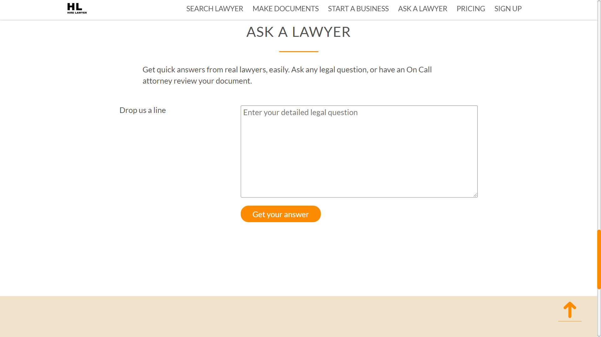
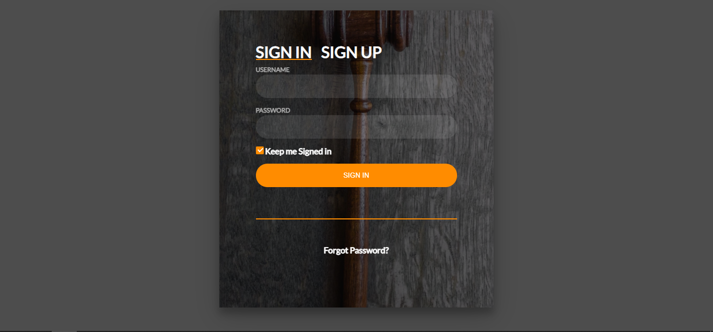

# hirelawyer
Hirelawyer website. 
- https://pavstar619.github.io/hirelawyer/ (frontend shown only)
- Main Site http://hire-lawyer.website/ (expired)

## How to Run website locally
```
git clone https://github.com/pavstar619/hirelawyer.git
// Install Xampp
// Copy hirelawyer folder in Xampp htdocs folder
// Run Xampp and import phplearning.sql to the MySQL server
```

## Youtube Videos: https://youtube.com/playlist?list=PLpuCqB-Y1M4uBXmVF_8p9-Rt3HK_B9L2G

## Showcase






